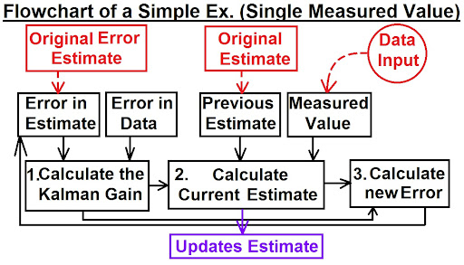

# Autonomous Adaptive Kalman Agent
This research log tracks both the evolution of the Kalman Agent, and my learning process as I work through its development. Each entry represents a new milestone reached and its practical application to the agent.

## 01/01/2026
For the majority of this project, I will be learning from Michel Van Biezen's Kalman Filter playlist on Youtube.

Having already produced part of the code for the Kalman agent, I will be spending the next few days working through concepts and explanations which have already been programmed, but I will be documenting my reflections from the videos to further my understanding and improve the code where possible.

### Introduction to the Kalman Filter.
* A Kalman Filter is a recursive mathematical process, executed iteratively.
* The purpose of the Kalman Filter is to quickly estimate the true value of the object being measured, when the measured values contain noise (error, uncertainty).

There are three main calculations:
1. Calculate the Kalman Gain.
1. Calculate the current estimate.
1. Calculate the new error in the estimate.

These calculations must be calculated iteratively in order for the Filter to improve its estimate and to approach the true value we are measuring.

#### Calculating Kalman Gain

To calculate the Kalman Gain, we need:
1. The error in the estimate:
    * In the first iteration, this will be the original estimate for the error.
    * In later iterations, this is the new error in the current estimate which we calculated in the previous iteration.
1. Error in the data input.

The Kalman Gain places a relative importance on the estimate compared to the error in the data, placing more importance on the value with the lower error. How much we can "trust" each of these values affects the recalculation on the current estimate.
#### Calculating current estimate

To calculate the current estimate, we need:
1. The Kalman Gain.
1. The previous estimate.
1. The data input.

Using the ranking of importance from the Kalman Gain, we decide which we trust more, the previous estimate or the data input, which is then used in calculating the current estimate.

#### Calculating new error in estimate
To calculate the new error, we need:
1. The current estimate.
2. The Kalman Gain.

Using these we calculate a new error, which will be fed into the next iteration.

#### Kalman Gain
The Kalman Gain is a "trust" factor.
* It optimally weighs the noise in our estimate against the noise in our data.
* Formula: K = $\frac{E_{EST}}{E_{EST} + E_{MEA}}$  
$0\ge K \ge 1$

## 02/01/2026

