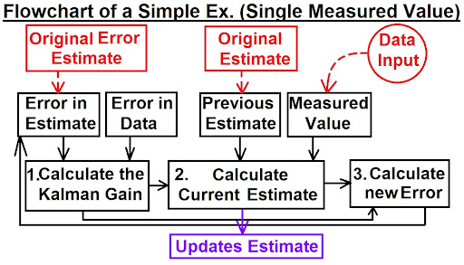

# Autonomous Adaptive Kalman Agent
This research log tracks both the evolution of the Kalman Agent, and my learning process as I work through its development. Each entry represents a new milestone reached and its practical application to the agent.  
  
For the majority of this project, I will be learning from Michel Van Biezen's Kalman Filter playlist on Youtube.  
  
Having already produced part of the code for the Kalman agent, I will be spending the next few days working through concepts and explanations which have already been programmed, but I will be documenting my reflections from the videos to further my understanding and improve the code where possible.

## Introduction to the Kalman Filter.
* A Kalman Filter is a recursive mathematical process, executed iteratively.
* The purpose of the Kalman Filter is to quickly estimate the true value of the object being measured, when the measured values contain noise (error, uncertainty).

There are three main calculations:
1. Calculate the Kalman Gain.
1. Calculate the current estimate.
1. Calculate the new error in the estimate.

These calculations must be calculated iteratively in order for the Filter to improve its estimate and to approach the true value we are measuring.

### The Kalman Gain $K$
The Kalman Gain is a "trust" factor, and places a relative importance on the estimate compared to the error in the data, placing more importance on the value with the lower error.

Formula:
* K = $\frac{E_{EST}}{E_{EST} + E_{MEA}}$ where $0\ge K \ge 1$

Meaning of the value:
* As the Kalman Gain approaches 1: measurements are more accurate, and estimates are unstable.  
* As the Kalman Gain approaches 0: measurements are inaccurate, and estimates are stable.  
  
As we iterate through the Kalman Filter, we expect the Kalman Gain to decrease as we approach the true value.

### Current Estimate
The current estimate is our guess in the current iteration for the value we are trying to calculate. It is equal to the previous estimate plus the Kalman Gain multiplied by the difference between the new measurement and the previous estimate.

Formula:
* $EST_t = EST_{t-1} + K(MEA - EST_{t-1})$

The current estimate is equal to the previous estimate plus the Kalman Gain multiplied by the difference between the new measurement and the previous estimate.

### Error in the Current Estimate
Formula:
* $^EEST_t = \frac{(E_{MEA})(^EEST_{t-1})}{(E_{MEA}) + (^EEST_{t-1})} \Rightarrow \> ^EEST_t = (1-K)(^EEST_{t-1})$

## The Multi-dimension Model
This is used when we want to track multiple variables, and places the Kalman Filter into a matrix format.  
A reminder of what the Kalman Filter does: takes an input from an observation. Takes a state of a particular situation. We receive information periodically. We want to keep updating where we think the value of the variable is at. We constantly receive measurements, and we make predications, and the Kalman Filter tells us which should hold greater value when calculating our estimate for each iteration.

### The process
1. Initial State - Contains a state matrix and a process covariance matrix, $X_0$ and $P_0$.
    * The state matrix $X_0$ typically contains the position and velocity of the value we are tracking in 1, 2, or 3 dimensions.
    * The process covariance matrix $P_0$ represents the error in the estimate / process.
1. As we iterate, the current state becomes the previous state, holding $X_{k-1}$ and $P_{k-1}$.
1. With a previous state, we are now able to calculate the prediction for the new state, $X_{k_p}$ and $P_{k_p}$.
    * $A$ and $B$ are adaptation matrices, and their purpose is to convert values into the correct format so that they can be used in the equations.
    * $X_{k_p} = AX_{k-1} + Bu_k + w_k$
        * This prediction makes use of the control variable matrix $u$, and we add on our prediction for how the control variables will affect the state matrix.
        * The predicted state noise matrix $w$ is also used to calculate the noise in that prediction.
    * $P_{k_p} = AP_{k-1}A^T + Q_k$
        * The process noise covariance matrix $Q$ accounts for any potential noise and needs to be accounted for in our prediction for the new process covariance matrix $P$.
1. After our prediction, we update it with the new measurement and the Kalman Gain to give us the updated state.
    * $H$ is also an adaptation matrix, like $A$ and $B$, and converts values into the correct format so that they can be used in the equations.
    * $Y_k = H_{k_m} + Z_k$
        * The measurement of the state $Y$.
        * As there may also be noise in the measurement, we need to add the measurement noise $Z$.
    * $K = \frac{P_{k_p}H^T}{HP_{k_p}H^T + R}$
        * The Kalman Gain decides how much we trust our estimate, and therefore what fraction of it we will use in our measurement and our prediction of the new state.
    * $X_k = X_{k_p} + K[Y-HX_{k_p}]$
1. Update the process covariance matrix $P$.
    * $P_k = (I - KH)P_{k_p}$
        * The matrix identity $I$.
    * $P$ is the error in the process of the Kalman Filter.
1. Output of the updated state.
    * The updated state matrix $X_k$
    * The updated process covariance matrix $P_k$
1. The process is then repeated.

### The State Matrix $X$
* The new state $X_k = AX_{k-1} + Bu_k + w_k$ consists of:
    * $X_{k-1}$ - previous state.
    * $u_k$ - control variable matrix.
    * $w_k$ - noise in the process.
    * $\Delta t$ - time for one cycle.

When calculating the movement of an object, we can use Newton's equations of motion.

#### Calculating $A X_{k-1}$
We multiply the previous state matrix by an adaptation matrix to put it into the correct format.

##### 1 Dimension
In one dimension, the state matrix will consist of a position, and a velocity.

* For position and velocity in the x direction:
$X = \begin{bmatrix} x \newline \dot{x} \end{bmatrix}$  
* For position and velocity in the y direction:
$X = \begin{bmatrix} y \newline \dot{y} \end{bmatrix}$

The adaptation matrix $A$ in one dimension.

$A = \begin{bmatrix} 1 \>\> \Delta t \newline 0 \>\>\>\> 1 \end{bmatrix}$

Multiplying $A$ by $X$: $AX = \begin{bmatrix} 1 \>\> \Delta t \newline 0 \>\>\>\> 1 \end{bmatrix}\begin{bmatrix} x \newline \dot{x} \end{bmatrix} = \begin{bmatrix} x + \Delta t \dot{x} \newline 0 + \dot{x} \end{bmatrix}$
* In the first row, we have the new position. This is calculated by adding the previous position to the distance moved (displacement = velocity * time).
* In the second row, we have the velocity.

##### 2 Dimensions
In two dimensions, the state matrix will consist of a position and velocity in the x direction, and a position and velocity in the y direction.

$X = \begin{bmatrix} x \newline y \newline \dot{x} \newline \dot{y} \end{bmatrix}$

#### Calculating $B u_k$
We multiply the control variable matrix by the adaptation matrix to get it into the correct format. $u_k$ represents the control variable, such as acceleration.

The $B$ matrix is derived from another equation of motion, $s = ut + \frac{1}{2} at^2$

$B = \begin{bmatrix} \frac{1}{2} \Delta t^2 \newline \Delta t \end{bmatrix}$

If there are no control variables active, $u_k = [0]$, or if it is acceleration, then $u_k = [a]$